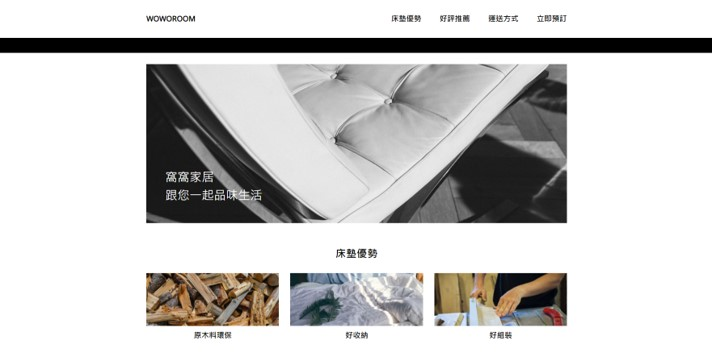

# WOWOROOM電商網站

透過 JavaScript 串接API實現網站功能

>前台: [點我](https://jacky010080.github.io/WoWoRoom/front)
> 
> 後台: [點我](https://jacky010080.github.io/WoWoRoom/back)

## 前台功能
將商品加入購物車
從購物車刪除單項商品
清空購物車
送出訂單

## 後台功能
更改訂單狀態
刪除單筆訂單
清除全部訂單

## 使用技術

1. JavaScript
2. C3.js
3. Axios
